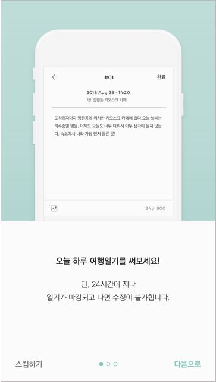
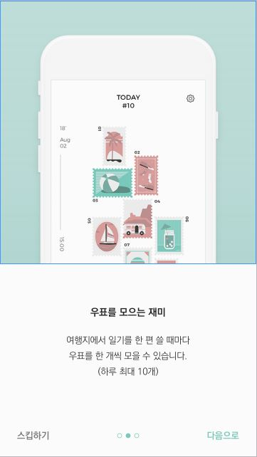
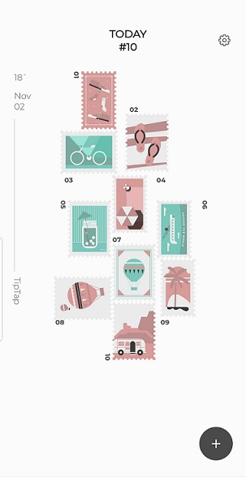

# 📃TipTap

### 나의 발자취를 담는 일기장.

 

 

## 주요 기능

### 1. 방문한 장소의 사진과 느낌을 적어보세요.
>작성할 때 마다 새로운 우표를 받을 수 있습니다.

### 2. 나의 팁탭을 타인과 공유해보세요.
>같은 장소에서 타인은 어떻게 느꼈을까요?

### 3. 쌓여가는 나의 발자취를 한눈에 확인해보세요.

## 미리 보기

### 1. 지금 이 장소의 사진과 느낌을 생생하게 기록해보세요.
</a>

### 2. 새로운 우표를 보아보세요.

### 3. 다른 사람들이 공유한 일기를 확인해 보세요.
</a>
## 사용 언어

* Kotlin
* Java

## 사용 아키텍처
* MVC(Model-View-Controller)

## 사용 라이브러리

* [RxAndroid](https://github.com/ReactiveX/RxAndroid) 
* [RxKotlin](https://github.com/ReactiveX/RxKotlin) 
* [Glide](https://github.com/bumptech/glide) - 이미지 관련 작업
* [Retrofit2](https://square.github.io/retrofit/) - 서버 통신
* [Okhttp](https://rometools.github.io/rome/) - 서버 통신

### v1.0

2018.11.11 출시예정
